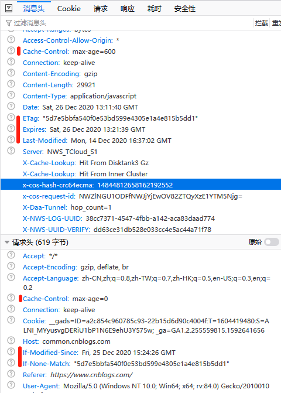

# http缓存控制

缓存控制无非就是决定要不要缓存，缓存多久有效，或缓存内容变化判断。

## 1.强缓存

服务器返回资源时，响应头可以带下面的信息：

```bash
Cache-Control: max-age=600
Cache-Control: no-cache
Expires: Sat, 26 Dec 2020 13:21:39 GMT
```

`Cache-Control`设置的`max-age`告诉浏览器这个资源缓存多久，单位是`秒`。

`Cache-Control`也可以直接设置成`no-cache`，表示不要缓存这个资源。

`Expires`设置的是一个日期，表示资源缓存的有效期。

`Cache-Control`还有别的设置项，但比较少用。

浏览器获取到响应头的这些设置，就知道这个资源多久有效，或有效期到什么时候。`max-age`的时间是相对服务器端来说的，一般服务器也会在头部加上`Date`信息，`max-age`上的时间就是以这个`Date`设置的时间点为起点。

`Cache-Control`的优先级大于`Expires`。

只要通过`Cache-Control`或`Expires`判断资源在有效期内，浏览器就直接使用缓存数据，不会发起请求。

当然，浏览器也可以不管这些信息依然发起请求，并且在请求头设置以下信息：

```bash
Cache-Control: no-cache
```

表示不需要缓存，还是向服务器请求资源。

## 2.协商缓存

服务器返回资源时，响应头可以带下面的信息：

```bash
ETag: "5d7e5bbfa540f0e53bd599e4305e1a4e815b5dd1"
Last-Modified: Mon, 14 Dec 2020 16:37:02 GMT
```

`ETag`是根据这个资源内容计算出来的标识串，内容不同，`ETag`的值也会不同，并且不同服务器算法不同。

`Last-Modified`告诉浏览器这个资源最近一次修改的时间点。它有两个问题，1.时间是秒级的，只能精确到秒，一秒内的变化不会反应出来；2.在有多台服务器时，请求有可能到不同服务器，不同服务器获取到的修改时间不同，会导致无故失效和缓存不更新问题。

浏览器发起请求时，请求头可以带下面信息：

```bash
If-None-Match: "5d7e5bbfa540f0e53bd599e4305e1a4e815b5dd1"
If-Modified-Since: Mon, 14 Dec 2020 16:37:02 GMT
```

`If-None-Match`设置的字符串是之前服务器返回该资源时响应头的`ETag`所设置的字符串，服务器拿到这个字符串就能判断浏览器的该资源内容跟服务器的该资源内容是否一样。只判断内容，就算中途经过多次修改，修改时间都变了，内容一样的话，这个字符串也会一样。

`If-Modified-Since`设置的时间点是服务器之前返回的响应头中`Last-Modified`设置的时间点。服务器通过该资源最后的修改时间，对比`If-Modified-Since`这个时间点，就能判断该资源是否已经修改过。

`If-None-Match`优先级大于`If-Modified-Since`，或者说`ETag`优先级大于`Last-Modified`。

如果服务器判断资源没被修改，就在响应头返回
```bash
304 Not Modified
```

## 这里截了一张火狐浏览器的一个请求的响应头和请求头的信息片段

